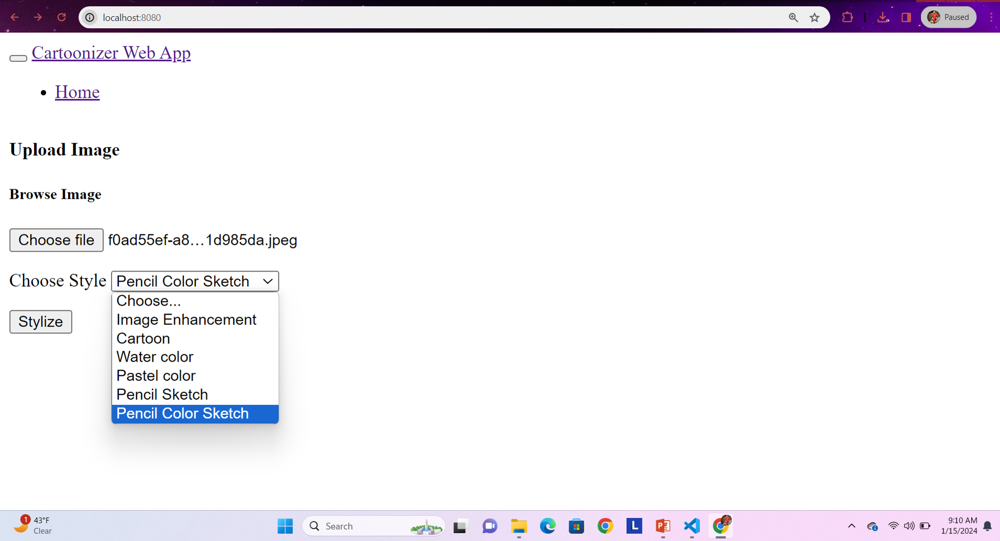

# CartoonifyCV-App
This project is a computer vision application that transforms real-world images into various stylized formats, including cartoon, pencil sketch, watercolor, and color sketch effects. Leveraging technologies such as OpenCV, Flask, and JavaScript, the application provides an interactive web interface where users can upload images and select the desired transformation effect. The backend processes the images using advanced image processing techniques such as color quantization, adaptive thresholding, and smoothing to generate artful renditions of the input photographs.

## Overview
CartoonifyCV-App is an interactive web-based application that converts standard images into a variety of artistic styles such as cartoons, pencil sketches, watercolor, and color sketches. This project combines computer vision and web technologies to provide a user-friendly platform for image stylization.

## Features
- **Multiple Stylization Effects**: Choose from cartoonify, pencil sketch, watercolor, and color sketch.
- **Real-time Previews**: Upload your image and instantly see the stylization effects.
- **Easy-to-use Interface**: Simple and intuitive web interface built with HTML, CSS, and JavaScript.

## Technologies Used
- **OpenCV**: For image processing tasks.
- **Flask**: Serving the web application and handling file uploads.
- **NumPy**: For handling high-level mathematical functions and multi-dimensional arrays.
- **HTML/CSS/JavaScript**: For front-end development.

## How to Run Locally
1. Clone the repository:

        git clone https://github.com/[YourGitHubUsername]/CartoonifyCV-App.git

2. Install dependencies:
  
       pip install -r requirements.txt

3. Run the Flask app:

        python app.py

4. Open your browser and go to `http://localhost:5000` to access the app.

## Contact
For any additional questions or feedback, please contact [sameerf737@gmail.com](mailto:sameerf737@gmail.com).

## License
This project is licensed under the MIT License - see the [LICENSE.md](LICENSE) file for details.

## Acknowledgements
Thanks to all the contributors and users of the open-source tools utilized in this project.

Feel free to adjust the content according to your project's specifics or your personal preferences!
